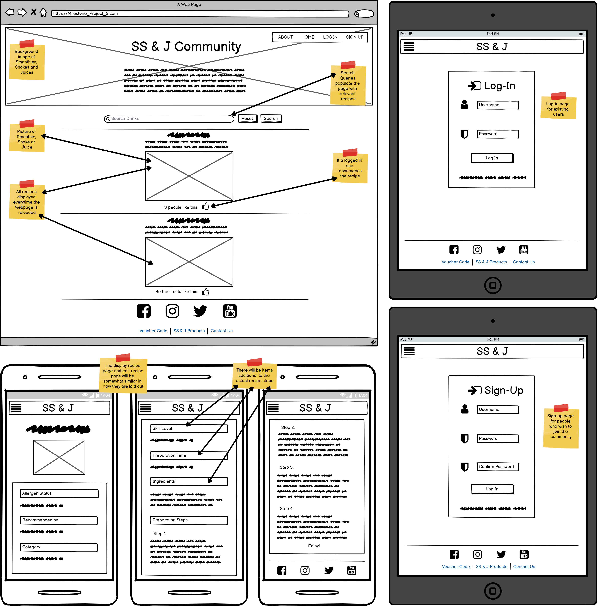
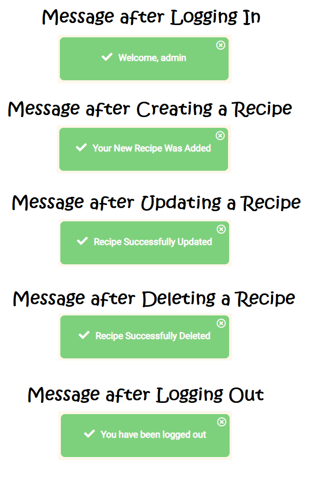

# Milestone Project 03 

### Smoothies, Shakes and Juices Community (SS&J)  

## Table of contents
1. [Introduction](#intro)
2. [Responsive Design](#responsive_design)
3. [My Project Description and Design](#project_description)
    1. [Wire Frames](#wire_frame)
    2. [Pop up Modals](#pop_modal)
    3. [Nav Bar](#nav_bar)
    4. [Hero Image](#hero_image)
    5. [Header & Description Text](#header_description)
    6. [Page Links and Button Navigation](#page_links)
    7. [flash_messages](#flash_messages)
    8. [Search Recipes](#search_recipes)
    9. [Default Recipe Image](#default_recipe)
    10. [Footer](#footer)
4. [Utilising the 5 Planes of UX Design](#ux_design)
    1. [The Strategy Plane](#strategy_plane)
    2. [The Scope Plane](#scope_plane)
    3. [The Structure Plane](#structure_plane)
    4. [The Skeleton Plane](#skeleton_plane)
    5. [The Surface Plane](#surface_plane)
5. [Typography](#typography)
6. [User Stories](#user_stories)
    1. [External User's Goal](#external_user_goal)
    2. [App Owner's Goal](#app_owner_goal)
    3. [First Time User Goals](#first_time_user_goals)
    4. [Returning User Goals](#returning_user_goals)
    5. [Frequent User Goals](#frequent_user_goals)
7. [Bugs and Fixes](#bug_fixes)
8. [References and Credits Section](#references_and_credits)
    1. [Code](#code)
    2. [Media](#media)
9. [User Testing](#testing)
    1. [Website Responsiveness through Browser and Device Compatibility](#testing_procedure)
    2. [Call to Action Functionality Testing](#testing_user_stories)
    3. [HTML CSS and JavaScript Validation](#validation)
10. [Future "Nice to Have" Additions to The Website](#additions)
11. [Creation of Template and Deployment of Project](#project_deployment)
    1. [Creating a New Project](#new_project)
    2. [Commands Utilised Throughout The Project After Changes](#commands)
    3. [How to Deploy My Milestone\_Project\_03 on Heroku](#how_to_deploy)
    4. [How to Download, View and Edit and Run this project locally](#how_to_download)
12. [Acknowledgements](#acknowledgements)  

## Introduction 

My Milestone Project 3 was envisioned by me and created based on the knowledge gained so far from this course. 
I have taken the fundamentals that I have learned from the course and applied them to this website with style and format changes. 
I have created Python, Jscript and jQuery functions where required to manipulate data, undertake logic and enable the end result back to the user.
I hope that the outcome of my works has translated into a web application UI, that shows and facilitates the CRUD functionality learned throughout the backend development module.
I feel by creating custom, re-usable python code and efficiently structuring my DataBase, I have created a system that could be scalable with minimal effort.
My goal was to create an application that visually appears accessible, responsive and easy to navigate through the use of HTML, CSS and Javascript.
As well as the course materials, there have been some additional code examples which I have searched for online and utilised.
These additions have been highlighted and referenced later on in this document (references and credits section).
As well as these additions I have received excellent feedback from my mentor Maranatha Ilesanmi.
Maranatha has re-capped and explained the reasons for comments I received from my last Milestone Project and has advised how to improve so that a distinction may be achieved this time around.
I have also added a section in this README file, where I explain what has been implemented in this project to counter act the reasons for falling down in the last project.

## Responsive Design 

As can be seen in the screenshot below, media queries and Materialize classes have been used to ensure that the website is completely responsive across Desktop and Mobile devices.

View the deployed project here:[ SS&J ](https://smoothies-shakes-and-juices.herokuapp.com/)  

## My Project Description and Design 

The SS&J website is a full-stack responsive website which utilises Python, JQuery & javasript methods and functions to carry out CRUD functionality using the Flask framewok and MongoDB Atlas. 
Please see initial envisioned wireframes for desktop and mobile devices (before project start) and actual screenshots of the finished website in the sections that follow:
  

### Wire Frames 

The wire-frames I found very useful for planning the structure and navigation required to make the CRUD functionality efficient and easy to follow. 
I wanted my main page to be the centre hub until logged in. Once logged-in, the users new centre hub becomes the profile page, which is essentially the main page without the search bar or hero image.
A number of redirects are used and placed in known locations that users that would be familiar with in keeping with good practise.
  

### Pop up Modals 

There are 2 pop up modals used on this application, The first encountered modal (base.html template) is triggered by a brightly coloured button in the task bar (desktop) or inside the hamburger menu on mobile.
The brightly coloured button is a way to catch the eye of the user and to try and attract them to click on it. Once they click on the button a modal appears which describes the offer
available to them as an SS&J community contributer. If they are an existing user there is information on how to proceed with the offer. 
If they are not an existing user they are presented with a link for joining the community and availing of the offer.

The second modal is linked to the profile page and it is triggered by pressing the "Delete" button for a specific recipe. 
It is a way of protecting against accidental deletion of a recipe. It provides the user with a way of opting out if delete was pressed accidentally 
and a way of giving the user a second chance if they had decided to delete the recipe but now have changed their mind.

  

### Nav Bar 

For this project I have decided to go with a Fixed nav-bar. Once the page is scrolled the navbar follows. 
I felt that having the navbar accessible from all locations on a scrolled page would be of benefit to the user.
It would mean easy access to the "Home", "Profile", "New Recipe" and "Log-Out" pages once logged in.
The nav-bar can be separated up into desktop and mobile views as seen below. 
The "HOME" button re-loads the main recipe page and re-directs you here if clicked from another location.
The "Profile" button navigates the user to their profile page to carry out CRUD actions.
The "New Recipe" button navigates the user to the New Recipe page where recipe details can be entered and saved.
The "Log In" button navigates the user to the log-in page so that username and password details can be entered.
The "Log Out" button uses the "session.pop" method to remove a signed-in user from the application and re-directs to the login page.
The "Sign-up" button navigates the user to the Sign-up page where a new SS&J account can be created.
The "Special Offer!" button pops up a modal which details information about how existing and new users can avail of cost reduction when purchasing items from Kitchen Aid.

  

### Hero Image 

The Hero Image that loads upon display of the main page is of an outdoor wooden style picnic bench with lots of fruit and glass bottles of juice on display. 
I have made this image semi-transparent to allow the green background colour to seep through a little, keeping everything flowing and in tune with the colour scheme. 
The image is responsive accross all sizes of device by utilising dedicated Materialize classes.

  

### Header & Description Text 

The Header text, when first landed on the page, is the name of the user community, "Smoothies, Shakes & Juices" and the description text below it is a small summary of 
what the community are about and where they are headed. The goal here is to encourage more users to join and spread the word.
  

### Page Links and Button Navigation 

In the image above I have detailed all the href, onClick and submit button navigations used in this project. 
All links have been incorporated with huge consideration to the users overall experience and ease of use.
It is my intention here to have the user feel a sense of familiarity by keeping everything quite similar to UI's, websites and layouts that I am familiar with using.
I have tried to make sure that every feature here conforms to modern best practise standards.
All links have been tested and are fully functional. The social media links in the footer open in separate tabs where required.
  

### Flash Messages 

The Flash messages being presented back have been styled to be more pleasing to the user. The style format is based on the appearance of well known Toastr messages.
They appear consistently at the top of the screen and convey a successfull transaction from the users input.
They are green in colour and have a font awesome tick which is widely associated with success. 
I have also written a JavaScript function to hide the message if the user wishes to click on the "X" located at the top right of the message.
  

### Search Recipes 

The search recipes search bar will query the index that I have created on my MongoDB database.
I created the index through the python3 command line in Gitpod.
The index is made up of "value" sections based on three "keys". The type being "text".
The three keys are: main_component_type, drink_name, and ingredients.
I feel that these keys will provide adequate results as most users are going to search by ingredients. 
The main component type will have the root ingredient also.
The drink name is for returning users who retain names of the drinks from a glance and search by it the next time around.
  

### Default Recipe Image 

The default recipe image is used for times when the user may not have a picture hosted online to represent their drink.
By simply clicking on the "Image URL" text link on the "New Recipe" page, the URL input gets populated with a known string and the div containing the input becomes hidden.
  

### Footer 

The footer contains 3 sections, 1. A weather widget which also updates upon utilising the Top 5 buttons, 2.  A small paragraph 
enticing visitors of the site to join the club. At the end of this paragraph is a font awesome icon (newsletter) which, if clicked/selected, will re-load the 
modal form again to allow the visitor a second time option to subscribe. 3. Social media icons which link to their respective pages, an email link which opens the 
visitors default email service and populates the “To” section with bookings@vwcc.com, and an external phone link shortcut for use when viewed on mobile phone devices.

To ensure that I utilised the correct icon colours for each of the social media outlets in the footer I navigated to their official brand media pages 
and used a HTML colour picker to select the correct colour. 
Please see the image below of the colours picked for each icon using the following HTML colour picker: https://imagecolorpicker.com/en/
  

  

## Utilising the 5 Planes of UX Design 

**The Strategy Plane** 

The strategy plane here is concerned with attracting like minded individuals to sign-up with the SS&J community and contribute to the growing recipe collection.
The main business objective here is to build a large community and expose them to weekly special offers.
As the community grows into large numbers I would envision creating additional partnerships with raw materials and blender outlets 
in order to increase revenues generated, by offering discounts to users on behalf of these partners. The use of the users "username" at checkout ensures a return for SS&J.

**The Scope Plane** 

Placeholder

**The Structure Plane** 

This app is a multi-page page layout that extends from the base template. I have tried to keep everything simplistic and familiar.
It is navigated from top to bottom with a fixed nav-bar at the top and a footer at the bottom. 
The nav-bar turns into a mobile friendly toggler once below a specific resolution. Underneath the nav-bar is where the “Hero-Image” is located. 
In desktop mode, the hero image is where the header text and info paragraph can be found.
In mobile view, the header text and info paragraph move to below the responsive image. 
I feel the clarity in the text is retained by not re-sizing in conjunction with the image.

The hero image, header text and info paragraph are only visible on the main page. The items common to all pages are the navbar, footer and special offer! modal only. 
Below the info paragraph, on the main page, the recipe search input field can be found and below that, all submitted recipes in the same format.
The format is: drink_name:, created_by:, user_recommends:, image_url:, see full recipe button.

If you are not a user, you will only have access to this main page, the sign-up page and the log in page.
If you are an existing user, after logging in you will have access to your profile page, 
a create new recipe page template and an edit recipe page where existing recipe data is retrieved for editing purposes.

The profile page is similar to the main landing page minus the hero image, text and search bar.
The profile page will display the recipes which have been submitted by you only. 
In the profile page, the functionality is given to the session user who created the recipe to "Read", "Update" or "Delete" any of your recipes.
By clicking on the "New Recipe" tab the user can carry out the "Create" functionality.

**The Skeleton Plane** 

The app will have a consistently placed background image on the main page with two sub sections below it (search bar and all recipes displayed).
The use of [colours](#colours), [fonts](#typography) and responsive elements were carefully chosen to add user expected functionality.
Careful consideration was given to making the content well placed, clear and well presented. This was achieved by utilising contrasting colours, 
right size, style fonts and adequate spacing. In order to try and create a professional sense I was quite selective with the images used from Unsplash.com
Again in this project, the Balsamic [wire frames](#wire_frame) have been a fantastic tool to envision what the end result would be.
There have only been subtle changes to the placement of elements and styles from what was originally envisioned through the wireframes.
The page is scrolled top to bottom and all major elements are center aligned with justified text where it fitted with the look required.

**The Surface Plane** 

The colours and imagery used on this website, I feel, are really in line with the recipe ingredients. I have kept greens as my main colour with a contrasting beige (old lace) as the background.
I have used white in the forms so I think the contrast between white and beige works well and allows separation between the background and the input forms.
The rest of the colours chosen are based on the hero image which had been envisioned and chosen before the colour scheme was finalised.
The palette I chose was created at [www.coolers.co](https://coolors.co/) 

I have used background shading and opacity shadows to highlight the hero Image header and the hovering and clicking of items throughout, 
the majority being influenced by Materialize CSS classes with subtle additions in my style.css.
I feel the contrasting colours and backgrounds separate the page elements enough so that they remain individual, yet part of a combined theme.
What I was trying to achieve and convey with the app layout was a mature use of colour which reflects the focal point, which is the ingredients themselves (veg, fruit, coffee, etc.).
Hovering over links, buttons and text selectors causes the elements to change colour, alerting the user to the presence of their mouse pointer.
I have included tool tips where I thought it necessary to further clarify an element or the purpose of a feature.
  

## Typography 

The fonts used for the milestone project are: “Handlee” and “Roboto”.

Both fonts were located and used from Google Fonts:[ Handlee ](https://fonts.google.com/specimen/Handlee?query=hand ) [ Roboto ](https://fonts.google.com/specimen/Roboto?query=roboto)

I felt the contrast between Handlee and Roboto works really well. I initiall picked Handlee based on how the site name looked (alomost like a logo).
I like the inviting and playful nature of Handlee for the not so serious stuff and then the use of easily readable Roboto when more thought and input is required by the user.
I have made subtle changes to the font colors, shadows, sizes and spacings for responsiveness as can be seen on the app and in the style.css sheet. 
  

## User stories 

**External user’s goal:** 

The potential app users will be a group of smoothie, shake or juice makers keen on sharing their home made recipes and learning how to create others. 

**App owner's goal:** 

The goal of the app to establish a community and unite like minded individuals with a passion for home made smoothies, shakes and juices.
As part of the ever growing community you have the option to visit a partnering site (this is a ficticious association which provides SS&J with commission on sales) which offer a discount when checking out online if you input your username.
This is achieved currently by pressing the "Special Offer!" button in the Navbar which triggers the modal pop-up. 
This pop-up advertisement is scalable and can be easily altered to reflect new weekly products, and its trigger mechanism could also be altered to a timer after page load through JavasScript.
It is envisioned that as the community grows that commission will also grow, and advertising will also expand to other potential pertners like Tesco for raw ingredient purchase through an SS&J loyalty card.

**First Time User Goals** 

- As a First Time User, I want information about the SS&J community (About Text). [Click for Screenshot](#header_description)
- As a First Time User, I want to read all submitted recipes on the main page. [Click for Screenshot](#hero_image)
- As a First Time User, I want to click on any one of the recipes and open it in its own page. [Click for Screenshot](#page_links)
- As a First Time User, I want to be able to navigate efficiently and cleanly through the apps pages. [Click for Screenshot](#page_links)
- As a First Time User, I want to sign-up to the SS&J community. [Click for Screenshot 1](#nav_bar) [Click for Screenshot 2](#page_links)
- As a First Time User, I want to view my unique profile page. [Click for Screenshot](#footer) To be added*********
- As a First Time User, I want to create one of my own recipes. [Click for Screenshot](#footer) To be added*********
- As a First Time User, I want to be able to "Like" other users recipes. [Click for Screenshot](#page_links) and recipe display page *********

**Returning User Goals** 

- As a Returning User, I want to be able to Log In and view my profile with submitted recipes. [Click for Screenshot](#page_links)
- As a Returning User, I want to check the special offers and visit the partnering site to avail of these offers. [Click for Screenshot](#pop_modal)
- As a Returning User, I want to create another one of my own recipes. [Click for Screenshot](#footer) To be added********
- As a Returning User, I want to read all recipes and new user created recipes, then click to open the recipes that I wish read or undertake. [Click for Screenshot](#hero_image) and recipe display page ********
- As a Returning User, I want to be able to "Like" other users recipes. [Click for Screenshot](#page_links) and recipe display page ********
- As a Returning User, I want to contact the SS&J community directly with any queries. [Click for Screenshot](#footer)

**Frequent User Goals** 

- As a Frequent User, I want to be able to Log In and view my profile with submitted recipes. [Click for Screenshot](#page_links)
- As a Frequent User, I want to check the new weekly special offers and visit the partnering site to avail of these offers. [Click for Screenshot](#pop_modal)
- As a Frequent User, I want to view all recipes and new user submitted recipes, then click to open the recipes that I wish read or undertake. [Click for Screenshot](#hero_image) and recipe display page ********
- As a Frequent User, I want to be able to "Like" other users recipes. [Click for Screenshot](#page_links) and recipe display page *******
- As a Frequent User, I want to see when a particular recipe is displayed, if I have "Liked" it or not. [Click for Screenshot](#footer) To be added*******
- As a Frequent User, I want to create another one of my own recipes. [Click for Screenshot](#footer) To be added******
- As a Frequent User, I want to be able to edit and update one of my existing recipes. [Click for Screenshot](#placeholder) To be added*******
- As a Frequent User, I want to be able to delete one of my existing recipes. [Click for Screenshot](#placeholder) To be added******
- As a Frequent User, I want to contact the SS&J community directly with any queries. [Click for Screenshot](#footer)
  

## Bugs and Bug Fixes 

During the creation of this project I encountered alot of self inflicted bugs due to unfamiliarity with the new additions in this module.
The majority of these bugs were flagged by the friendly Werkzeug powered traceback interpreter. 
I became very familiar with this form of fault diagnosis and towards the end of the project I could understand exactly where I had gone wrong.
I am happy that I was able to eliminate and overcome any bugs encountered during the creation of this app.

Please see 3 of the major bugs and their commit messages below:

1.) Commit Message: > Bugfix: 0 value Likes displayed instead of DB stored value: "0d8ac5dbcc287158896b6ca08772ab8c71add0da"

2.) Commit Message: > Bugfix: Disable cross user editing of recipes: "667d3a6d36e51ff79bbfd538a6d1b4e37521f646"

3.) Commit Message: > Bugfix: Search query results correctly displaying on main page: "6d3d9f5528427c1bcb45716813cbd9df8bbb4fae" 
  
Google Inspect was used to eliminate styling and format bugs encountered. 
For any other fixes to bugs that were encountered that could not be visualised, 
I used console.log() for JS, print() for Python and displayed Jinja output to a div to visualise the results.
Changes were then made from there to fix code or eliminate the bug completely.
  

## References and Credits Section 

**Code:** 

The JS code for the double password confirmation was found in the following location:
[ Diego Leme https://codepen.io/diegoleme/pen/surIK ](https://codepen.io/diegoleme/pen/surIK)
  

**The following is a list of external stylesheets, scripts, frameworks, modules and dependencies used in the creation of this project:**

Materialize Minified Stylesheet:
[ Materialize ](https://cdnjs.cloudflare.com/ajax/libs/materialize/1.0.0/css/materialize.min.css)

Fontawesome Stylesheet:
[ Fontawesome cdn ](https://cdnjs.cloudflare.com/ajax/libs/font-awesome/5.15.3/css/all.min.css) 

Google fonts Stylesheets:
[ Google Font1 ](https://fonts.googleapis.com/css2?family=Handlee&display=swap) 
[ Google Font2 ](https://fonts.googleapis.com/css2?family=Roboto&display=swap)

JavaScript scripts:
[ Materialize ](https://cdnjs.cloudflare.com/ajax/libs/materialize/1.0.0/js/materialize.min.js)
[ JQuery ](https://code.jquery.com/jquery-3.6.0.min.js)

Python Frameworks and Imported Modules:
[ Flask ](https://flask.palletsprojects.com/en/2.0.x/)
[ flask_pymongo ](https://flask-pymongo.readthedocs.io/en/latest/)
[ bson](https://bsonspec.org/) [ bson.objectid ](https://docs.mongodb.com/manual/reference/method/ObjectId/)
[ werkzeug.security ](https://werkzeug.palletsprojects.com/en/2.0.x/utils/)
  

The Contents of My "requirement.txt" file:

click==8.0.1

dnspython==2.1.0

Flask==2.0.1

Flask-PyMongo==2.3.0

itsdangerous==2.0.1

Jinja2==3.0.1

MarkupSafe==2.0.1

pymongo==3.11.4

Werkzeug==2.0.1
  

**Media** 

The photos used for the hero Image and the submitted recipes were taken from [https://unsplash.com/ ](https://unsplash.com/).

Please see list of credits below for the owner of each photo: 

* alex-loup-BvwhziJ2Lm4-unsplash – Photo by[ Alex Loup ](https://unsplash.com/@alexloup?utm_source=unsplash&utm_medium=referral&utm_content=creditCopyText)on[ Unsplash ](https://unsplash.com/)
  
* alexander-mils-ocku3zjNM7k-unsplash – Photo by[ Alexander Mils ](https://unsplash.com/@alexandermils?utm_source=unsplash&utm_medium=referral&utm_content=creditCopyText)on[ Unsplash ](https://unsplash.com/)
  
* denis-tuksar-n73TTunlskE-unsplash – Photo by[ Denis Tuksar ](https://unsplash.com/@dtuksar?utm_source=unsplash&utm_medium=referral&utm_content=creditCopyText)on[ Unsplash ](https://unsplash.com/)

* skyler-h-mjYpDxTbojs-unsplash – Photo by[ Skyler H ](https://unsplash.com/@skyler029?utm_source=unsplash&utm_medium=referral&utm_content=creditCopyText)on[ Unsplash ](https://unsplash.com/)
  
* jugoslocos-8DEIlmz7IfA-unsplash – Photo by[ Jugos locos ](https://unsplash.com/@jugoslocos?utm_source=unsplash&utm_medium=referral&utm_content=creditCopyText)on[ Unsplash ](https://unsplash.com/)
  
I’d like to say a huge thank you to the photographers who provided the content above via Unsplash for the creation of this ficticious app.
  

**Content:** 

The content for this site is based on numerous searches carried out in preparation for its creation. 
The initial recipes were in part, created based on recipes found on the BBC Good Food recipes. 
The remaining recipes are based on smoothies I have created in the past.

I was initially inspired by [ Jamie Oliver's ](https://www.jamieoliver.com/) website and it was the starting point for my colour scheme.
The finished product has changed alot from what was envisioned based on his site but it has, I feel remained true to the wireframes.
  

